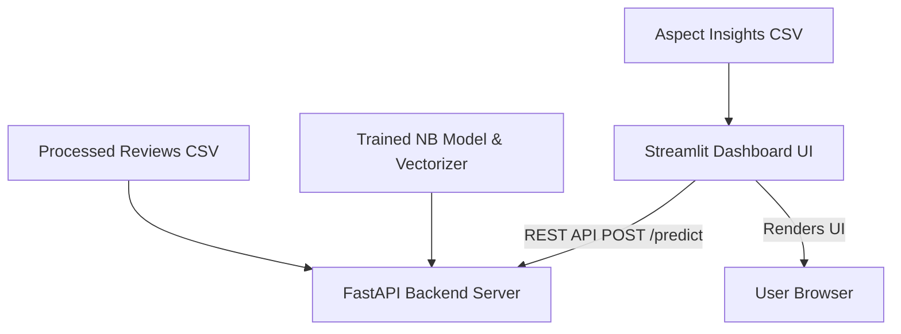

# ReviewPulse - End-to-End Product Intelligence Pipeline

ReviewPulse is a full-stack NLP (Natural Language Processing) product intelligence pipeline designed to load, clean, analyze, classify, and visualize customer reviews of mobile phones. The application extracts granular sentiments and aspect-level feedback to provide actionable insights for product features.

---

## Decoupled Architecture

The application is built using a decoupled architecture, dividing model inference from visualization to support scaling:



1. **FastAPI Inference Server (`app/api.py`)**:
   - Acts as the backend engine running on port `8000`.
   - Exposes a POST `/predict` endpoint that receives review text, applies preprocessing matching the training data, vectorizes it using TF-IDF, and returns predictions with probability scores.
   
2. **Streamlit Interactive Dashboard (`app/dashboard.py`)**:
   - Runs on port `8501`.
   - Displays EDA metrics, sentiment balances, and aspect-based insights.
   - Hosts a prediction sandbox where users can type custom review text, which queries the FastAPI backend asynchronously and displays real-time results.

---

## Data Preprocessing & EDA Snapshot

Preprocessing on the first 15,000 records of the raw Amazon Cell Phones Reviews dataset resulted in:
* **Initial Dataset Size**: 15,000 parsed rows (excluding missing values).
* **Word Compression Metrics**:
  - Average Word Count (Before Cleaning): **67.68 words**
  - Average Word Count (After Cleaning): **34.94 words**
  - Vocabulary Reduction Rate: **48.37%** (achieved through tokenization, lowercasing, punctuation removal, English stopword exclusion, and WordNet lemmatization).
* **Class Sentiment Balance**:
  - **Positive**: 10,272 reviews (**68.48%**)
  - **Negative**: 3,494 reviews (**23.29%**)
  - **Neutral**: 1,234 reviews (**8.23%**)

---

## Vectorization Matrix Analysis

We implemented two representation paradigms for classification and semantic analysis:
1. **TF-IDF & Bag-of-Words Matrices**:
   - Sparse representations limited to `max_features=5000` to balance computational efficiency and feature resolution.
   - Resulting matrices shape: **`(15000, 5000)`**
2. **Word2Vec Continuous Dense Embeddings**:
   - Implemented using Gensim.
   - Trains a **100-dimensional dense vector space** representing semantic word affinities based on context windows of size 5. Used to initialize the deep LSTM embedding layer.

---

## Classifier Performance Metrics

Model evaluation on the 20% validation split (3,000 reviews) yielded the following side-by-side performance:

### 1. Naive Bayes Baseline (TF-IDF Features)
* **Overall Accuracy**: **79%**

| Class | Precision | Recall | F1-Score | Support |
| :--- | :---: | :---: | :---: | :---: |
| **Negative** | 0.83 | 0.51 | 0.63 | 699 |
| **Neutral** | 0.00 | 0.00 | 0.00 | 247 |
| **Positive** | 0.79 | 0.99 | 0.88 | 2054 |

### 2. Deep LSTM Network (Word2Vec Embedding Initialization)
* **Overall Accuracy**: **73%**

| Class | Precision | Recall | F1-Score | Support |
| :--- | :---: | :---: | :---: | :---: |
| **Negative** | 0.51 | 0.80 | 0.62 | 699 |
| **Neutral** | 0.00 | 0.00 | 0.00 | 247 |
| **Positive** | 0.86 | 0.80 | 0.83 | 2054 |

> [!NOTE]
> **Engineering Note on the Class Imbalance Paradox**:
> The Naive Bayes classifier achieves 79% overall accuracy primarily because it overpredicts the dominant class (`positive`, 68.5% of samples), yielding a high recall of 99% for positive reviews. Both models completely fail to predict the underrepresented `neutral` class (0% precision/recall).
>
> While the LSTM has lower raw accuracy (73%), it demonstrates better balance in detecting negative reviews (80% recall compared to Naive Bayes' 51%). In highly imbalanced datasets, raw accuracy is a misleading metric; evaluating macro averages or class-specific recall is essential to understanding model capability.

---

## Aspect Sentiment Core Discovery

Using syntactic dependency parsing and Part-of-Speech tagging via spaCy, we extracted adjectives modifying key product aspects. The results highlight distinct customer feedback focus zones:

| Aspect | Positive Mentions | Negative Mentions | Sentiment Ratio (Pos:Neg) | Analysis |
| :--- | :---: | :---: | :---: | :--- |
| **Screen** | 1,282 | 161 | ~8.0 : 1 | Highly praised, main point of interest |
| **Camera** | 861 | 122 | ~7.1 : 1 | Highly praised |
| **Price** | 562 | 49 | ~11.5 : 1 | Outstanding approval ratio (Best value) |
| **Battery** | 433 | 199 | ~2.2 : 1 | Most contested (High rate of complaints) |
| **Sound** | 119 | 29 | ~4.1 : 1 | Positive |
| **Software** | 95 | 35 | ~2.7 : 1 | Contested (Mixed reviews) |

---

## Local Setup Guide

### 1. Requirements Installation
Ensure Python 3.10+ is active. Install all required libraries:
```bash
pip install -r requirements.txt
```

Ensure the spaCy model is installed:
```bash
python -m spacy download en_core_web_sm
```

### 2. Environment Verification
Verify that dataset and model assets exist:
* Data files: `data/processed_reviews.csv`, `data/aspect_insights.csv`
* Model assets: `models/tfidf_vectorizer.pkl`, `models/naive_bayes_model.pkl`

### 3. Startup Scripts

Start the FastAPI inference backend server:
```bash
uvicorn app.api:app --host 127.0.0.1 --port 8000
```

In a separate terminal, launch the Streamlit frontend dashboard:
```bash
streamlit run app/dashboard.py
```
Open your browser at `http://localhost:8501` to access the interface.
